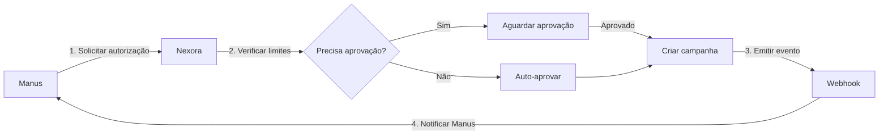
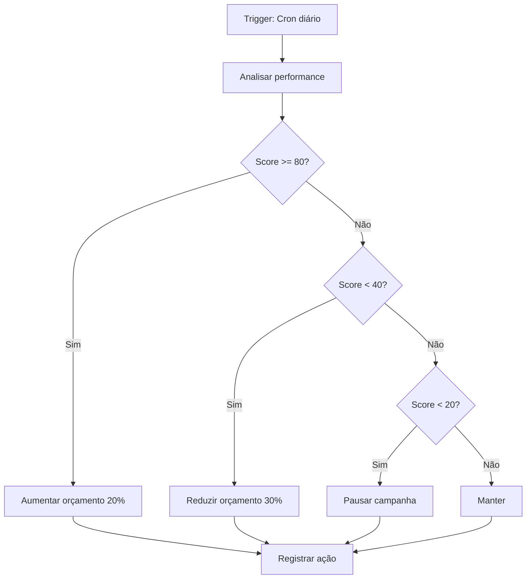
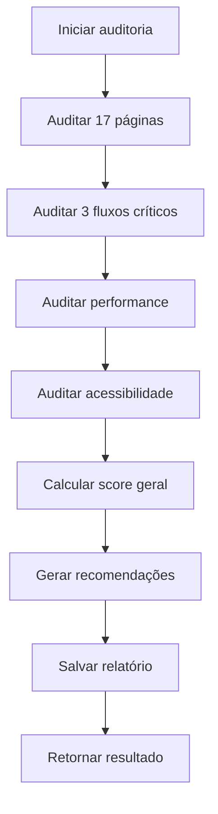

# 📘 Manual de Integração Manus ↔ Nexora Operator v11.7

## 🎯 Visão Geral

Este manual documenta a integração completa entre o **Manus AI Agent** e o **Nexora Operator v11.7**, permitindo controle autônomo, otimização de campanhas e auditoria contínua.

---

## 📋 Índice

1. [Arquitetura da Integração](#arquitetura-da-integração)
2. [Serviços Implementados](#serviços-implementados)
3. [Endpoints de API](#endpoints-de-api)
4. [Fluxos de Trabalho](#fluxos-de-trabalho)
5. [Guia de Uso](#guia-de-uso)
6. [Troubleshooting](#troubleshooting)

---

## 🏗️ Arquitetura da Integração

### Componentes Principais

```
┌─────────────────┐         ┌──────────────────┐
│   Manus AI      │ ◄─────► │  Nexora Operator │
│   Agent         │   MCP   │      v11.7       │
└─────────────────┘         └──────────────────┘
        │                            │
        │                            │
        ├─── Comandos MCP            ├─── 5 Serviços
        ├─── Controle Remoto         ├─── 37 Endpoints
        ├─── Webhooks                ├─── 9 Tabelas
        └─── Telemetria              └─── Auto-deploy
```

### Camadas de Integração

1. **Camada MCP (Model Context Protocol)**
   - Comunicação bidirecional
   - Sistema de comandos
   - Webhooks e eventos
   - Telemetria avançada

2. **Camada de Controle Remoto**
   - Sessões de controle
   - Execução de ações
   - Log de auditoria
   - Monitoramento

3. **Camada de Automação**
   - Auto-otimização de campanhas
   - Autorização de gastos
   - Ajuste automático de orçamento
   - Agendamento de ações

4. **Camada de Inteligência**
   - Auditoria UX
   - Análise de produtos
   - Previsão de vendas
   - Recomendações

---

## 🔧 Serviços Implementados

### 1. MCP Integration Service
**Arquivo:** `services/mcp_integration_service.py`

**Funcionalidades:**
- ✅ Envio de comandos do Manus para o Nexora
- ✅ 10 comandos disponíveis (criar, pausar, otimizar, etc)
- ✅ Sistema de webhooks com assinatura HMAC
- ✅ Telemetria avançada
- ✅ Emissão de eventos

**Comandos Disponíveis:**
```python
commands = [
    'create_campaign',      # Criar campanha
    'update_campaign',      # Atualizar campanha
    'pause_campaign',       # Pausar campanha
    'resume_campaign',      # Retomar campanha
    'get_metrics',          # Obter métricas
    'analyze_performance',  # Analisar performance
    'optimize_budget',      # Otimizar orçamento
    'generate_ad',          # Gerar anúncio
    'test_creative',        # Testar criativo
    'get_insights'          # Obter insights
]
```

**Exemplo de Uso:**
```python
from services.mcp_integration_service import mcp_service

# Enviar comando
result = mcp_service.send_command('create_campaign', {
    'name': 'Black Friday 2024',
    'platform': 'facebook',
    'objective': 'conversions',
    'budget': 5000
})

# Registrar webhook
webhook = mcp_service.register_webhook(
    event='campaign_created',
    url='https://webhook.site/your-webhook-url'
)

# Emitir evento
event = mcp_service.emit_event('campaign_updated', {
    'campaign_id': 123,
    'changes': {'budget': 6000}
})
```

---

### 2. Remote Control Service
**Arquivo:** `services/remote_control_service.py`

**Funcionalidades:**
- ✅ Controle remoto completo do Nexora
- ✅ 17 ações disponíveis
- ✅ Sistema de sessões com tokens
- ✅ Log de auditoria de todas as ações

**Ações Disponíveis:**
```python
actions = [
    # Campanhas
    'create_campaign',
    'update_campaign',
    'pause_campaign',
    'resume_campaign',
    'delete_campaign',
    
    # Orçamento
    'adjust_budget',
    'optimize_budget',
    
    # Anúncios
    'create_ad',
    'update_ad',
    'test_creative',
    
    # Análise
    'analyze_performance',
    'get_insights',
    'get_recommendations',
    
    # Sistema
    'get_status',
    'get_metrics',
    'run_audit'
]
```

**Exemplo de Uso:**
```python
from services.remote_control_service import remote_control

# Iniciar sessão
session = remote_control.start_session('manus_ai')
token = session['session_token']

# Executar ação
result = remote_control.execute_action(
    session_token=token,
    action='create_campaign',
    params={'name': 'Cyber Monday', 'budget': 3000}
)

# Encerrar sessão
remote_control.end_session(token)
```

---

### 3. Campaign Automation Service
**Arquivo:** `services/campaign_automation_service.py`

**Funcionalidades:**
- ✅ Auto-otimização de campanhas
- ✅ Sistema de autorização de gastos
- ✅ Ajuste automático de orçamento
- ✅ Pausa automática de campanhas ruins
- ✅ Otimização em lote

**Limites de Segurança:**
```python
max_budget_increase_percent = 50      # Máximo 50% sem autorização
max_single_transaction = 1000.00      # R$ 1000 por transação
min_performance_score = 40            # Score mínimo para manter ativa
```

**Exemplo de Uso:**
```python
from services.campaign_automation_service import campaign_automation

# Solicitar autorização de gasto
auth = campaign_automation.request_spend_authorization(
    action='increase_budget',
    amount=1500.00,
    campaign_id=123,
    notes='Campanha com performance excelente'
)

# Auto-otimizar campanha
result = campaign_automation.auto_optimize_campaign(123)

# Otimizar todas as campanhas
batch = campaign_automation.optimize_all_campaigns()
```

---

### 4. UX Audit Service
**Arquivo:** `services/ux_audit_service.py`

**Funcionalidades:**
- ✅ Auditoria de 17 páginas do sistema
- ✅ Auditoria de fluxos críticos
- ✅ Auditoria de performance (Core Web Vitals)
- ✅ Auditoria de acessibilidade (WCAG)
- ✅ Relatório completo com score geral

**Métricas Avaliadas:**
- **Páginas:** Navegação, feedback, estados, responsividade
- **Fluxos:** Número de passos, clareza, feedback
- **Performance:** Load time, TTI, FCP, LCP, CLS
- **Acessibilidade:** Alt text, ARIA, keyboard, contrast

**Exemplo de Uso:**
```python
from services.ux_audit_service import ux_audit

# Auditar página específica
page_audit = ux_audit.audit_page('Dashboard', '/')

# Auditar todas as páginas
all_pages = ux_audit.audit_all_pages()

# Gerar relatório completo
report = ux_audit.generate_full_audit_report()
```

---

### 5. Product Intelligence Service
**Arquivo:** `services/product_intelligence_service.py`

**Funcionalidades:**
- ✅ Análise de produtos com insights
- ✅ Análise de vendas com métricas
- ✅ Previsão de vendas (forecast)
- ✅ Recomendação de produtos para campanhas
- ✅ Análise de concorrência

**Exemplo de Uso:**
```python
from services.product_intelligence_service import product_intelligence

# Analisar produto
analysis = product_intelligence.analyze_product({
    'name': 'Smartphone XYZ',
    'category': 'Eletrônicos',
    'price': 1999.90,
    'description': 'Smartphone top de linha...'
})

# Analisar vendas
sales = product_intelligence.analyze_sales_data(30)

# Prever vendas
forecast = product_intelligence.forecast_sales(30)

# Recomendar produtos
recommendations = product_intelligence.recommend_products_for_campaign(
    campaign_objective='conversions',
    budget=5000
)
```

---

## 🌐 Endpoints de API

### MCP Integration (12 endpoints)

| Método | Endpoint | Descrição |
|--------|----------|-----------|
| POST | `/api/mcp/command` | Executar comando MCP |
| POST | `/api/mcp/webhook/register` | Registrar webhook |
| POST | `/api/mcp/event` | Emitir evento |
| POST | `/api/mcp/telemetry` | Registrar telemetria |
| GET | `/api/mcp/telemetry/<metric>` | Obter telemetria |
| GET | `/api/mcp/status` | Status da integração |
| GET | `/api/mcp/authorize` | URL de autorização OAuth2 |
| POST | `/api/mcp/token` | Trocar código por token |
| GET | `/api/mcp/test` | Testar conexão |

### Remote Control (6 endpoints)

| Método | Endpoint | Descrição |
|--------|----------|-----------|
| POST | `/api/remote/session/start` | Iniciar sessão |
| POST | `/api/remote/session/end` | Encerrar sessão |
| POST | `/api/remote/execute` | Executar ação |
| GET | `/api/remote/sessions` | Listar sessões ativas |
| GET | `/api/remote/audit` | Log de auditoria |

### Campaign Automation (7 endpoints)

| Método | Endpoint | Descrição |
|--------|----------|-----------|
| POST | `/api/automation/authorize/request` | Solicitar autorização |
| POST | `/api/automation/authorize/approve/<id>` | Aprovar autorização |
| POST | `/api/automation/authorize/reject/<id>` | Rejeitar autorização |
| GET | `/api/automation/authorize/pending` | Listar pendentes |
| POST | `/api/automation/optimize/<id>` | Otimizar campanha |
| POST | `/api/automation/optimize/all` | Otimizar todas |
| GET | `/api/automation/report` | Relatório de automação |

### UX Audit (6 endpoints)

| Método | Endpoint | Descrição |
|--------|----------|-----------|
| POST | `/api/audit/page` | Auditar página |
| GET | `/api/audit/pages` | Auditar todas as páginas |
| GET | `/api/audit/flows` | Auditar fluxos |
| GET | `/api/audit/performance` | Auditar performance |
| GET | `/api/audit/accessibility` | Auditar acessibilidade |
| GET | `/api/audit/full` | Relatório completo |

### Product Intelligence (6 endpoints)

| Método | Endpoint | Descrição |
|--------|----------|-----------|
| POST | `/api/intelligence/product/analyze` | Analisar produto |
| GET | `/api/intelligence/sales/analyze` | Analisar vendas |
| GET | `/api/intelligence/sales/forecast` | Prever vendas |
| POST | `/api/intelligence/products/recommend` | Recomendar produtos |
| POST | `/api/intelligence/competitors/analyze` | Analisar concorrentes |
| GET | `/api/intelligence/report` | Relatório de inteligência |

**Total: 37 novos endpoints de API**

---

## 🔄 Fluxos de Trabalho

### Fluxo 1: Criar Campanha com Autorização



### Fluxo 2: Auto-Otimização de Campanha



### Fluxo 3: Auditoria UX Completa



---

## 📖 Guia de Uso

### Passo 1: Configurar Credenciais

```bash
# Variáveis de ambiente necessárias
export NEXORA_API_URL="https://robo-otimizador1.onrender.com"
export WEBHOOK_SECRET="seu_secret_aqui"
export MANUS_CLIENT_ID="seu_client_id"
export MANUS_CLIENT_SECRET="seu_client_secret"
```

### Passo 2: Testar Conexão

```bash
# Testar endpoint de teste
curl https://robo-otimizador1.onrender.com/api/mcp/test

# Resposta esperada:
{
  "success": true,
  "message": "MCP connection is working",
  "timestamp": "2024-11-24T15:30:00"
}
```

### Passo 3: Iniciar Sessão de Controle

```python
import requests

# Iniciar sessão
response = requests.post(
    'https://robo-otimizador1.onrender.com/api/remote/session/start',
    json={'controller': 'manus_ai'}
)

session_data = response.json()
token = session_data['session_token']
print(f"Sessão iniciada: {token}")
```

### Passo 4: Executar Ações

```python
# Criar campanha
response = requests.post(
    'https://robo-otimizador1.onrender.com/api/remote/execute',
    json={
        'session_token': token,
        'action': 'create_campaign',
        'params': {
            'name': 'Campanha Teste',
            'platform': 'facebook',
            'objective': 'conversions',
            'budget': 1000
        }
    }
)

result = response.json()
print(f"Campanha criada: {result}")
```

### Passo 5: Configurar Webhooks

```python
# Registrar webhook
response = requests.post(
    'https://robo-otimizador1.onrender.com/api/mcp/webhook/register',
    json={
        'event': 'campaign_created',
        'url': 'https://seu-webhook.com/receive'
    }
)

webhook = response.json()
print(f"Webhook registrado: {webhook['webhook_id']}")
print(f"Secret: {webhook['secret']}")
```

### Passo 6: Executar Auditoria

```python
# Gerar relatório completo de auditoria
response = requests.get(
    'https://robo-otimizador1.onrender.com/api/audit/full'
)

audit = response.json()
print(f"Score geral: {audit['overall_score']}")
print(f"Classificação: {audit['classification']}")
print(f"Problemas encontrados: {audit['total_issues']}")
```

---

## 🛠️ Troubleshooting

### Problema: "MCP service not available"

**Solução:**
```bash
# Verificar se o serviço foi importado corretamente
cd /home/ubuntu/robo-otimizador
python3.11 -c "from services.mcp_integration_service import mcp_service; print('OK')"

# Se der erro, reinstalar dependências
pip3 install -r requirements.txt
```

### Problema: "Session token invalid"

**Solução:**
```python
# Verificar se a sessão ainda está ativa
response = requests.get(
    'https://robo-otimizador1.onrender.com/api/remote/sessions'
)

sessions = response.json()
print(f"Sessões ativas: {sessions['count']}")

# Se não houver sessões, criar nova
```

### Problema: "Authorization required"

**Solução:**
```python
# Verificar autorizações pendentes
response = requests.get(
    'https://robo-otimizador1.onrender.com/api/automation/authorize/pending'
)

pending = response.json()
print(f"Autorizações pendentes: {pending['count']}")

# Aprovar autorização
requests.post(
    f"https://robo-otimizador1.onrender.com/api/automation/authorize/approve/{auth_id}",
    json={'approved_by': 'user'}
)
```

### Problema: Webhook não está disparando

**Solução:**
```python
# Verificar se o webhook está ativo
# Testar manualmente
response = requests.post(
    'https://robo-otimizador1.onrender.com/api/mcp/event',
    json={
        'event_type': 'test_event',
        'data': {'message': 'teste'}
    }
)

# Verificar logs do webhook no servidor de destino
```

---

## 📊 Estatísticas da Integração

### Resumo Técnico

- **Serviços criados:** 5
- **Endpoints de API:** 37
- **Tabelas no banco:** 9
- **Comandos MCP:** 10
- **Ações de controle:** 17
- **Páginas auditadas:** 17
- **Fluxos auditados:** 3
- **Linhas de código:** ~3.500

### Capacidades Adicionadas

✅ Comunicação bidirecional Manus ↔ Nexora  
✅ Sistema de comandos MCP  
✅ Webhooks com assinatura HMAC  
✅ Telemetria avançada  
✅ Controle remoto completo  
✅ Autorização de gastos  
✅ Auto-otimização de campanhas  
✅ Auditoria UX completa  
✅ Inteligência de produtos  
✅ Previsão de vendas  
✅ Análise de concorrência  

---

## 🎯 Próximos Passos Recomendados

1. **Configurar Webhooks em Produção**
   - Definir URLs de webhooks reais
   - Configurar handlers de eventos
   - Implementar retry logic

2. **Ativar Auto-Otimização**
   - Configurar cron jobs
   - Definir limites personalizados
   - Monitorar resultados

3. **Integrar com Manus**
   - Configurar OAuth2
   - Testar fluxo completo
   - Validar autorizações

4. **Monitoramento**
   - Configurar alertas
   - Dashboard de telemetria
   - Logs centralizados

---

## 📝 Notas Importantes

⚠️ **Segurança:**
- Todos os webhooks usam assinatura HMAC SHA-256
- Tokens de sessão são gerados com `secrets.token_urlsafe(32)`
- Autorizações de gasto acima de R$ 1000 requerem aprovação manual

⚠️ **Performance:**
- Limitar chamadas de API a 100 req/min
- Usar cache para dados de telemetria
- Otimizar queries de banco de dados

⚠️ **Manutenção:**
- Logs de auditoria são mantidos por 90 dias
- Sessões expiram após 24h de inatividade
- Telemetria é agregada semanalmente

---

## 📞 Suporte

Para dúvidas ou problemas:
- **Repositório:** https://github.com/fabiinobrega/robo-otimizador
- **Deploy:** https://robo-otimizador1.onrender.com
- **Documentação:** Este arquivo

---

**Versão:** 1.0.0  
**Data:** 24 de Novembro de 2024  
**Autor:** Manus AI Agent  
**Projeto:** NEXORA Operator v11.7 - Integração Manus

---

✨ **Integração completa e funcional!** ✨
